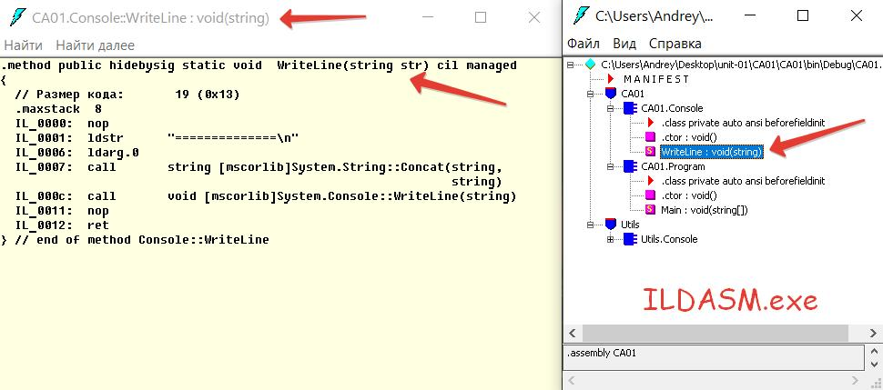
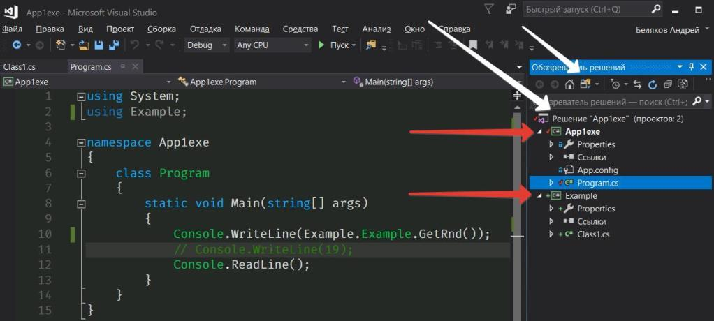

## unit-02
### классы и объекты

23.05.2020  

---

Концепции:  
* class и new
* class и объект
* конструктор
* this
* перегрузка методов
* поля с модификатором static

---

некоторые возможности дизассемблера из сборки (.exe или .dll)  
C:\Program Files (x86)\Microsoft SDKs\Windows\v10.0A\bin\NETFX 4.8 Tools\ildasm.exe  


как сделать Одно решение из нескольких проектов...  
варианты представления в Обозревателе решений  



_Практика:_

* типы данных
* примитивные типы данных
* декларируем класс
* создаём объект
* создаём список объектов
* поле static из класса
* перегрузка методов, конструкторов

---

Лабораторная работа 7 - 23.05.2020
Техническое задание по модулю unit-02 - взять за основу решение с Лекции и доработать:  
* чтобы точки были разного цвета
* чтобы при движении точки следы за ней затирались
* чтобы точки отражались от верхней/нижней стороны
* чтобы при нажатии на пробел точки останавливались, при следующем нажатии запускались
* чтобы при нажатии влево/вправо смещались влево/вправо с учётом не выхода за границы
* чтобы при генерации точек не было совпадающих по координатам точек
_пример работы модно увидеть в папке [example](https://github.com/permCoding/se-20/tree/master/unit-02/example)_  

--- 

```
Примерный порядок разработки проекта на Лекции:
step-01
класс Точки и его объект, вывод полей
step-02
список точек, добавляем одну и ту же точку, изменяем в одном из элементов поле объекта Точки - смотрим изменения во всех - объект ссылочного типа, вывод foreach
step-03
конструктор с параметрами, + конструктор по умолчанию со ссылкой this, в каждый элемент списка добавляем свою точку new
step-04
случайные координаты для точек, поле id, статическая индексация объектов, проверяем удаляя
step-05
методы класса
размеры экрана, отключение курсора, метод установки точки на экране, заменяем вывод на установку
step-06 ...
добавим обработку клавиатурных событий
добавим метод движения по Y, добавим отражение от стен, нужно поле объекта shiftY
далее самостоятельное творчество
```

можно эти шаги увидеть:
- в папке [part-02](https://github.com/permCoding/se-20/tree/master/unit-02/example)  
- в отдельном репозитории (позже будет удалён), который делали прямо на Лекции с последовательной фиксацией всех шагов коммитами - [Points](https://github.com/permCoding/Points)
  
  
---

**далее - это материал для использования на последующих занятиях - ещё не раскрыт**  
Концепции:  
* аргументы Main(string[] args)
* передача параметров по ссылке, по значению
* partial class


Практика:  
* оценка времени работы программы
* найти строку в файле: линейный и бинарный поиск

Файл со списком слов русского языка:  
[https://pcoding.ru/txt/words.txt](https://pcoding.ru/txt/words.txt)  

```
загрузим файл:	
new WebClient().DownloadFile(url_file, Path.GetFileName(url_file));
```
